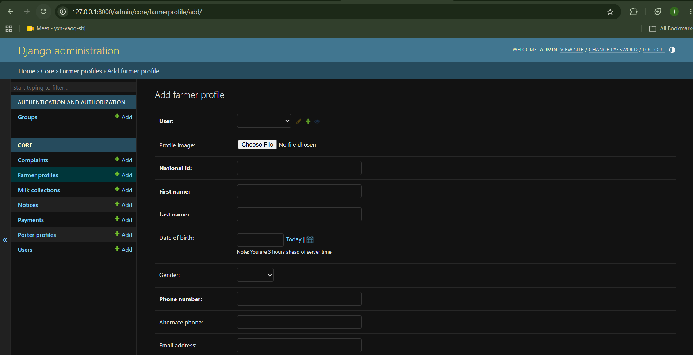

# MaziwaSync

## Project Overview

MaziwaSync is a Cooperative Management Information System designed to digitize and streamline milk collection, farmer management, communication, and operational analytics within dairy cooperatives.

The system aims to improve transparency, efficiency, accountability, and communication between cooperative administrators, milk porters/collectors, and farmers.

Traditionally, many dairy cooperatives rely on manual records, paper-based tracking, and inefficient communication channels, which often lead to data inconsistencies, delayed payments, poor farmer engagement, and operational inefficiencies. MaziwaSync addresses these challenges through a centralized digital platform built using Django and Django REST Framework.

The platform supports multiple user roles, including administrators, milk porters, and farmers, each with role-specific dashboards and functionalities.

---

# Core Features

* Role-based authentication and authorization
* Milk collection tracking
* Farmer supply monitoring
* Porter activity management
* Cooperative analytics dashboard
* Complaint and feedback management
* Notice board and announcements
* AI-powered sentiment analysis for farmer feedback
* Payment tracking and future Mpesa B2C integration
* Reporting and operational insights

---

# User Roles

## Administrator

Administrators oversee the entire cooperative system. They can:

* Monitor total milk collection
* View porter performance
* Manage farmer complaints
* Publish notices and announcements
* Track analytics and reports
* Monitor payment estimations

---

## Porter / Milk Collector

Porters are responsible for collecting milk from farmers and recording:

* Farmer details
* Amount of milk collected
* Collection session (morning/evening)
* Date and time of collection

---

## Farmer

Farmers can:

* View milk supply history
* Track expected payments
* View notices and announcements
* Submit complaints and comments
* Monitor complaint resolution status
* View supply analytics and trends

---

# Objectives

The main objective of MaziwaSync is to modernize cooperative operations by providing a scalable, secure, and data-driven platform that enhances operational efficiency and farmer welfare.

The system also seeks to improve farmer engagement, operational monitoring, communication, and decision-making through centralized data management and analytics.

---

# Technology Stack

* Backend Framework: Django
* API Framework: Django REST Framework
* Database: MySQL
* Authentication: JWT Authentication
* API Documentation: drf-spectacular (Swagger/OpenAPI)
* Future Integrations:

  * Mpesa Daraja API
  * AI Sentiment Analysis

---

# Software Development Methodology

The project follows an Agile Software Development Lifecycle (SDLC) approach to support iterative development, continuous improvement, modular feature implementation, and continuous testing throughout the course development process.

Development will be carried out in iterative phases (sprints), allowing gradual implementation of features such as authentication, milk collection management, dashboards, analytics, complaints management, and payment integration.

---

# Future Enhancements

* Mpesa B2C automated farmer payments
* AI-based farmer sentiment classification
* SMS notification integration
* Advanced analytics and reporting
* Multi-cooperative support
* Mobile application integration

---

# System Architecture and Application Design

## Architectural Design Decision

MaziwaSync follows a modular application architecture based on the principle of **Separation of Concerns (SoC)**.

Instead of placing all functionalities into a single Django application, the system is divided into specialized modules where each application handles a specific domain responsibility. This improves:

* Maintainability
* Scalability
* Code organization
* Readability
* Team collaboration
* Testing and debugging

The architecture also aligns with professional software engineering practices used in production systems.

---

# Core Design Principles Applied

## 1. Separation of Concerns (SoC)

Each application is responsible for a specific business domain.

Example:

* Authentication logic should not be mixed with milk collection logic.
* Farmer operations should not directly control cooperative administrative operations.

This reduces coupling and improves maintainability.

---

## 2. Modularity

The project is broken into independent modules (apps) that can evolve separately without heavily affecting the entire system.

This supports:

* easier updates
* feature expansion
* isolated testing
* cleaner architecture

---

## 3. Scalability

The architecture is designed to support future enhancements such as:

* Mpesa integration
* AI sentiment analysis
* SMS notifications
* mobile applications
* multi-cooperative support

without requiring major restructuring.

---

## 4. Reusability

Shared functionalities such as authentication, permissions, and notifications can be reused across multiple modules.

---

## 5. Maintainability

A well-structured modular system is easier to debug, document, test, and maintain over time.

---

# System Applications

The project uses five main Django applications.

---

# 1. Core Application


## Responsibilities

The core application handles:

* Custom User model
* Authentication
* JWT Authentication
* Registration
* Authorization & Permissions
* User Roles
* User Profiles
* Base Models
* Shared Utilities
* Shared Mixins

Supported Roles
* Administrator
* Farmer
* Porter / Milk Collector

## Engineering Reasoning

A dedicated core app provides:
- The Core application contains all system-wide functionality required by every other module. Since authentication, authorization, user management, and role handling are foundational concerns used throughout the system, keeping them together with the custom User model provides a single source of truth and reduces unnecessary application fragmentation.

---

# 2. Accounts Application

## Responsibilities

The accounts application handles:

* User authentication
* JWT authentication
* User registration
* Role management
* User profiles
* Authorization and permissions

## Supported Roles

* Administrator
* Farmer
* Porter / Milk Collector

## Engineering Reasoning

Authentication is isolated because it is a shared system-wide responsibility used across all modules.

---

# 3. Cooperative Application

## Responsibilities

The cooperative application handles:

* Cooperative dashboard
* Notices and announcements
* Complaints management
* Analytics and reports
* Payment calculations
* Farmer welfare tracking
* Administrative operations

## Engineering Reasoning

Administrative and management operations are grouped together because they belong to the cooperative business domain.

---

# 4. Collector Application

## Responsibilities

The collector application handles:

* Milk collection records
* Collection sessions
* Farmer milk entries
* Daily collection tracking
* Collection history

## Engineering Reasoning

Milk collection is the system's operational core process and deserves isolation from administrative logic.

---

# 5. Farmer Application

## Responsibilities

The farmer application handles:

* Farmer dashboard
* Supply history
* Farmer analytics
* Complaints submission
* Viewing notices
* Payment estimations

## Engineering Reasoning

Farmer-facing functionality is isolated to improve user-specific logic management and support future mobile or farmer portal integrations.

---

# Initial Project Setup

## Step 1: Create the Django Project

```bash
django-admin startproject maziwasyncapi
```

Move into the project directory:

```bash
cd maziwasyncapi
```

---

## Step 2: Create Virtual Environment

```bash
python -m venv venv
```

Activate the environment.

### Windows

```bash
venv\Scripts\activate
```

### Linux/macOS

```bash
source venv/bin/activate
```

---

## Step 3: Install Dependencies

```bash
pip install django djangorestframework mysqlclient drf-spectacular djangorestframework-simplejwt django-cors-headers python-decouple
```

---

## Step 4: Save Dependencies

```bash
pip freeze > requirements.txt
```

---

## Step 5: Create the Applications

```bash
python manage.py startapp core
python manage.py startapp cooperative
python manage.py startapp collector
python manage.py startapp farmer
```

---

## Step 6: Configure Settings

### AUTH_USER_MODEL Declaration

In `maziwasyncapi/settings.py`:

```python
AUTH_USER_MODEL = 'core.User'
```

### INSTALLED_APPS Configuration

```python
INSTALLED_APPS = [
    # Default Django Apps
    'django.contrib.admin',
    'django.contrib.auth',
    'django.contrib.contenttypes',
    'django.contrib.sessions',
    'django.contrib.messages',
    'django.contrib.staticfiles',

    # Third-Party Apps
    'rest_framework',
    'drf_spectacular',

    # Local Apps
    'core',
    'accounts',
    'cooperative',
    'collector',
    'farmer',
]
```

### REST Framework Configuration

```python
REST_FRAMEWORK = {
    'DEFAULT_AUTHENTICATION_CLASSES': (
        'rest_framework_simplejwt.authentication.JWTAuthentication',
    ),
    'DEFAULT_PERMISSION_CLASSES': (
        'rest_framework.permissions.IsAuthenticated',
    ),
    'DEFAULT_SCHEMA_CLASS': 'drf_spectacular.openapi.AutoSchema',
    'DEFAULT_PAGINATION_CLASS': 'rest_framework.pagination.PageNumberPagination',
    'PAGE_SIZE': 20,
}
```

### JWT Settings

```python
from datetime import timedelta

SIMPLE_JWT = {
    'ACCESS_TOKEN_LIFETIME': timedelta(days=1),
    'REFRESH_TOKEN_LIFETIME': timedelta(days=7),
}
```

### Database Configuration

```python
from decouple import config

DATABASES = {
    'default': {
        'ENGINE': 'django.db.backends.mysql',
        'NAME': config('DB_NAME', default='maziwasyncdb'),
        'USER': config('DB_USER', default='root'),
        'PASSWORD': config('DB_PASSWORD', default=''),
        'HOST': config('DB_HOST', default='localhost'),
        'PORT': config('DB_PORT', default='3306'),
    }
}
```

### CORS Configuration

```python
CORS_ALLOW_ALL_ORIGINS = True  # Development only
```

### Static & Media Files

```python
STATIC_URL = 'static/'
STATIC_ROOT = os.path.join(BASE_DIR, 'staticfiles')

MEDIA_URL = 'media/'
MEDIA_ROOT = os.path.join(BASE_DIR, 'media')
```

### Environment Variables (.env file)

```env
SECRET_KEY=your-super-secret-key-change-this
DEBUG=True
ALLOWED_HOSTS=localhost,127.0.0.1

DB_NAME=maziwasyncdb
DB_USER=root
DB_PASSWORD=
DB_HOST=localhost
DB_PORT=3306
```

---
You're absolutely right! Here's the corrected `core/models.py` section for your README.md that matches YOUR actual implementation:


## Step 7: Create Models in Core Application

In `core/models.py`:

```python
from django.db import models
from django.contrib.auth.models import AbstractUser

# ============================================================
# CUSTOM USER MODEL (First - before any profile uses it)
# ============================================================

class User(AbstractUser):
    """Custom User model with role-based access"""
    ROLE_CHOICES = (
        ('farmer', 'Farmer'),
        ('porter', 'Porter'),
        ('admin', 'Admin'),
    )
    role = models.CharField(max_length=10, choices=ROLE_CHOICES, default='farmer')
    phone_number = models.CharField(max_length=15, unique=True)
    
    def __str__(self):
        return f"{self.username} ({self.role})"


# ============================================================
# BASE ABSTRACT MODEL
# ============================================================

class BaseModel(models.Model):
    """Abstract base model with common timestamp fields"""
    created_at = models.DateTimeField(auto_now_add=True)
    updated_at = models.DateTimeField(auto_now=True)
    
    class Meta:
        abstract = True


# ============================================================
# FARMER PROFILE
# ============================================================

class FarmerProfile(BaseModel):
    """Complete farmer profile - all information a cooperative needs"""
    
    user = models.OneToOneField(
        User, 
        on_delete=models.CASCADE, 
        related_name='farmer_profile'
    )
    
    # Personal Information
    profile_image = models.ImageField(
        upload_to='farmers/profiles/', 
        null=True, 
        blank=True
    )
    national_id = models.CharField(max_length=20, unique=True)
    first_name = models.CharField(max_length=100)
    last_name = models.CharField(max_length=100)
    date_of_birth = models.DateField(null=True, blank=True)
    gender = models.CharField(
        max_length=10, 
        choices=[('MALE', 'Male'), ('FEMALE', 'Female')], 
        null=True, 
        blank=True
    )
    
    # Contact Information
    phone_number = models.CharField(max_length=15, unique=True)
    alternate_phone = models.CharField(max_length=15, blank=True, null=True)
    email_address = models.EmailField(blank=True, null=True)
    
    # Farm Information
    farm_name = models.CharField(max_length=200, blank=True, null=True)
    farm_size_acres = models.DecimalField(max_digits=6, decimal_places=2, null=True, blank=True)
    number_of_cows = models.IntegerField(default=0)
    membership_number = models.CharField(max_length=50, unique=True, blank=True, null=True)
    join_date = models.DateField(auto_now_add=True)
    
    # Banking Information
    bank_name = models.CharField(max_length=100, blank=True, null=True)
    bank_branch = models.CharField(max_length=100, blank=True, null=True)
    account_number = models.CharField(max_length=50, blank=True, null=True)
    mpesa_number = models.CharField(max_length=15, blank=True, null=True)
    
    # Statistics (auto-updated by system)
    total_milk_delivered = models.DecimalField(max_digits=12, decimal_places=2, default=0)
    total_earnings = models.DecimalField(max_digits=15, decimal_places=2, default=0)
    
    def __str__(self):
        return f"{self.first_name} {self.last_name}"


# ============================================================
# PORTER PROFILE
# ============================================================

class PorterProfile(BaseModel):
    """Porter/Collector profile"""
    
    user = models.OneToOneField(
        User, 
        on_delete=models.CASCADE, 
        related_name='porter_profile'
    )
    profile_image = models.ImageField(
        upload_to='porters/profiles/', 
        null=True, 
        blank=True
    )
    employee_id = models.CharField(max_length=20, unique=True)
    first_name = models.CharField(max_length=100)
    last_name = models.CharField(max_length=100)
    phone_number = models.CharField(max_length=15, unique=True)
    national_id = models.CharField(max_length=20, unique=True)
    route_name = models.CharField(max_length=200)
    assigned_farmers = models.ManyToManyField(
        FarmerProfile, 
        related_name='assigned_porters', 
        blank=True
    )
    hire_date = models.DateField(auto_now_add=True)
    is_active = models.BooleanField(default=True)
    total_collections = models.IntegerField(default=0)
    total_liters_collected = models.DecimalField(max_digits=12, decimal_places=2, default=0)
    
    def __str__(self):
        return f"{self.first_name} {self.last_name} - {self.employee_id}"


# ============================================================
# MILK COLLECTION
# ============================================================

class MilkCollection(BaseModel):
    """Daily milk collection record"""
    
    SESSION_CHOICES = [
        ('MORNING', 'Morning'),
        ('EVENING', 'Evening'),
    ]
    
    farmer = models.ForeignKey(
        FarmerProfile, 
        on_delete=models.CASCADE, 
        related_name='collections'
    )
    porter = models.ForeignKey(
        PorterProfile, 
        on_delete=models.CASCADE, 
        related_name='collections'
    )
    liters = models.DecimalField(max_digits=10, decimal_places=2)
    session = models.CharField(max_length=10, choices=SESSION_CHOICES)
    collection_date = models.DateField(auto_now_add=True)
    price_per_liter = models.DecimalField(max_digits=8, decimal_places=2, default=50.00)
    total_amount = models.DecimalField(max_digits=12, decimal_places=2, blank=True, null=True)
    
    def __str__(self):
        return f"{self.collection_date}: {self.farmer.first_name} - {self.liters}L"
    
    def save(self, *args, **kwargs):
        self.total_amount = self.liters * self.price_per_liter
        super().save(*args, **kwargs)


# ============================================================
# FEEDBACK
# ============================================================

class Feedback(BaseModel):
    """Farmer complaints tracking"""
    
    STATUS_CHOICES = [
        ('PENDING', 'Pending'),
        ('RESOLVED', 'Resolved'),
        ('REJECTED', 'Rejected'),
    ]
    
    farmer = models.ForeignKey(
        FarmerProfile, 
        on_delete=models.CASCADE, 
        related_name='feedbacks'
    )
    title = models.CharField(max_length=200)
    description = models.TextField()
    status = models.CharField(max_length=10, choices=STATUS_CHOICES, default='PENDING')
    resolved_by = models.ForeignKey(
        User, 
        on_delete=models.SET_NULL, 
        null=True, 
        blank=True
    )
    
    def __str__(self):
        return self.title


# ============================================================
# NOTICE / ANNOUNCEMENT
# ============================================================

class Notice(BaseModel):
    """System announcements for different user groups"""
    
    TARGET_CHOICES = [
        ('ALL', 'All Users'),
        ('FARMERS', 'Farmers Only'),
        ('PORTERS', 'Porters Only'),
    ]
    
    title = models.CharField(max_length=200)
    message = models.TextField()
    target = models.CharField(max_length=10, choices=TARGET_CHOICES, default='ALL')
    created_by = models.ForeignKey(User, on_delete=models.CASCADE)
    is_important = models.BooleanField(default=False)
    
    def __str__(self):
        return self.title


# ============================================================
# PAYMENT
# ============================================================

class Payment(BaseModel):
    """Payment records for milk deliveries"""
    
    STATUS_CHOICES = [
        ('PENDING', 'Pending'),
        ('COMPLETED', 'Completed'),
        ('FAILED', 'Failed'),
    ]
    
    METHOD_CHOICES = [
        ('MPESA', 'M-Pesa'),
        ('CASH', 'Cash'),
    ]
    
    farmer = models.ForeignKey(
        FarmerProfile, 
        on_delete=models.CASCADE, 
        related_name='payments'
    )
    amount = models.DecimalField(max_digits=12, decimal_places=2)
    payment_method = models.CharField(max_length=10, choices=METHOD_CHOICES)
    status = models.CharField(max_length=10, choices=STATUS_CHOICES, default='PENDING')
    transaction_ref = models.CharField(max_length=100, unique=True)
    payment_date = models.DateTimeField()
    
    def __str__(self):
        return f"{self.transaction_ref} - KES {self.amount}" ```
```
---

## Step 8: Create and Apply Migrations

```bash
python manage.py makemigrations
python manage.py migrate
```

---

## Database Schema Overview

The core app contains the following models:

| Model | Purpose |
|-------|---------|
| `User` | Custom user with role-based authentication |
| `BaseModel` | Abstract base with timestamps (inherited by all models) |
| `FarmerProfile` | Complete farmer information and statistics |
| `PorterProfile` | Milk collector/porter information |
| `MilkCollection` | Daily milk collection records |
| `Complaint` | Farmer complaint tracking |
| `Notice` | System announcements |
| `Payment` | Payment records for milk deliveries |

## Model Relationships

```
User (auth)
  ├── FarmerProfile (OneToOne)
  │     ├── MilkCollection (ForeignKey)
  │     ├── Complaint (ForeignKey)
  │     └── Payment (ForeignKey)
  │
  └── PorterProfile (OneToOne)
        ├── MilkCollection (ForeignKey)
        └── assigned_farmers (ManyToMany with FarmerProfile)
```


---

## Step 8: Create and Apply Migrations

```bash
python manage.py makemigrations
python manage.py migrate
```

---

# Expected Project Structure

```
maziwasyncapi/
│
├── core/
│   ├── models.py
│   ├── admin.py
│   └── ...
│
├── cooperative/
├── collector/
├── farmer/
│
├── maziwasyncapi/
│   ├── settings.py
│   └── ...
│
├── manage.py
└── requirements.txt
```

---

# Important Engineering Decisions

## Why Core App Instead of Accounts App for User Model?

| Consideration | Benefit |
|--------------|---------|
| Circular Imports | Clean dependency tree |
| Reusability | System-wide accessibility |
| Separation of Concerns | Pure base model isolation |
| Future Extensibility | Easy to add shared models |

## Migration Strategy (Critical Order)

1. Create `core` app and define `User` model
2. Set `AUTH_USER_MODEL = 'core.User'` in settings
3. Register all apps in INSTALLED_APPS
4. Create migrations for all apps simultaneously
5. Apply migrations in one operation

---

# ⚠️ Critical Reminders

1. **Never change AUTH_USER_MODEL after migrations** - It's set for the project lifetime
2. **Core app must be in INSTALLED_APPS** - Other apps depend on it
3. **Always reference User as `settings.AUTH_USER_MODEL`** - Never import directly
4. **Document architectural decisions** - Future developers need to understand design choices

---

# Engineering Questions Considered During Design

## System Architecture Questions

* Should the system use monolithic or modular architecture?
* How can the project remain scalable as features grow?
* Which responsibilities belong to which modules?

## Authentication Questions

* Should user roles be separated or centralized?
* Should the system extend Django's default user model?
* How can permissions be managed securely?

## Database Design Questions

* How should relationships between farmers, collectors, and collections be structured?
* How can data consistency be maintained during transactions?
* Should transactional operations support rollback mechanisms?

## Scalability Questions

* Can the architecture support future Mpesa integration?
* Can AI features be added without restructuring the system?
* Can mobile applications consume the same APIs later?

## Maintainability Questions

* How can code duplication be minimized?
* How can future developers easily understand the system?
* How can debugging and testing be simplified?

---

# Software Engineering Principles Applied

1. **Single Responsibility Principle** - Each app handles one domain
2. **Separation of Concerns** - Clear boundaries between modules
3. **Don't Repeat Yourself (DRY)** - Shared logic in core app
4. **API-First Design** - All features exposed via REST endpoints
5. **Security by Design** - JWT authentication, environment variables
```


Here's the formatted section for your README.md:

```markdown
## Step 9: Register Models in Django Admin

Create `core/admin.py`:

```python
from django.contrib import admin
from .models import User, FarmerProfile, PorterProfile, MilkCollection, Complaint, Notice, Payment

# Register Custom User
@admin.register(User)
class UserAdmin(admin.ModelAdmin):
    list_display = ('username', 'email', 'role', 'phone_number', 'is_staff')
    list_filter = ('role', 'is_staff')
    search_fields = ('username', 'email', 'phone_number')

# Register FarmerProfile
@admin.register(FarmerProfile)
class FarmerProfileAdmin(admin.ModelAdmin):
    list_display = ('first_name', 'last_name', 'phone_number', 'farm_name', 'total_milk_delivered')
    search_fields = ('first_name', 'last_name', 'phone_number', 'national_id')
    list_filter = ('gender', 'join_date')

# Register PorterProfile
@admin.register(PorterProfile)
class PorterProfileAdmin(admin.ModelAdmin):
    list_display = ('first_name', 'last_name', 'employee_id', 'route_name', 'total_collections')
    search_fields = ('first_name', 'last_name', 'employee_id')
    list_filter = ('is_active', 'hire_date')

# Register MilkCollection
@admin.register(MilkCollection)
class MilkCollectionAdmin(admin.ModelAdmin):
    list_display = ('farmer', 'liters', 'session', 'collection_date', 'total_amount')
    list_filter = ('session', 'collection_date')
    search_fields = ('farmer__first_name', 'farmer__last_name', 'porter__first_name', 'porter__last_name')
    readonly_fields = ('total_amount',)

# Register Complaint
@admin.register(Complaint)
class ComplaintAdmin(admin.ModelAdmin):
    list_display = ('title', 'farmer', 'status', 'created_at')
    list_filter = ('status',)
    search_fields = ('title', 'farmer__first_name', 'farmer__last_name')

# Register Notice
@admin.register(Notice)
class NoticeAdmin(admin.ModelAdmin):
    list_display = ('title', 'target', 'is_important', 'created_at')
    list_filter = ('target', 'is_important')
    search_fields = ('title', 'message')

# Register Payment
@admin.register(Payment)
class PaymentAdmin(admin.ModelAdmin):
    list_display = ('farmer', 'amount', 'payment_method', 'status', 'payment_date')
    list_filter = ('status', 'payment_method')
    search_fields = ('farmer__first_name', 'farmer__last_name', 'transaction_ref')
```

---

## Step 10: Create Admin Superuser

```bash
python manage.py createsuperuser
```

Follow the prompts to create an admin account:

```
Username: admin
Email: admin@example.com
Password: yourpassword
```

---

## Step 11: Run Development Server

```bash
python manage.py runserver
```

Access the applications:

- Admin Panel: http://127.0.0.1:8000/admin/
- API Endpoints: http://127.0.0.1:8000/api/

---

## Admin Panel Features

After registering all models, the Django admin panel provides:

| Model | Admin Capabilities |
|-------|-------------------|
| **User** | View, filter by role, search users |
| **FarmerProfile** | Manage farmer data, search by name/ID/national ID |
| **PorterProfile** | Manage porters, filter by active status |
| **MilkCollection** | View collections, filter by session/date, auto-calculated amounts |
| **Complaint** | Track and resolve farmer complaints |
| **Notice** | Create and manage announcements for different user groups |
| **Payment** | Track payment status and methods |

---

## Admin Screenshot





# Step 12: Implement Core Authentication

MaziwaSync uses JWT (JSON Web Token) Authentication through Django REST Framework SimpleJWT.

The authentication module is responsible for:

* Registering Farmers
* Registering Porters
* User Login
* User Logout
* Token Refresh
* Retrieving Current Logged-in User Information

---

# Authentication URLs

Create `accounts/urls.py`

```python
from django.urls import path
from .views import LogoutView, RegisterView, LoginView, MeView
from rest_framework_simplejwt.views import TokenRefreshView

urlpatterns = [
    path('auth/register/', RegisterView, name='register'),
    path('auth/login/', LoginView, name='login'),
    path('auth/logout/', LogoutView, name='logout'),
    path('auth/me/', MeView, name='me'),

    # Refresh Access Token
    path('token/refresh/', TokenRefreshView.as_view(), name='token_refresh'),
]
```

---

# JWT Configuration

Inside `settings.py`

```python
from datetime import timedelta

SIMPLE_JWT = {
    'ACCESS_TOKEN_LIFETIME': timedelta(minutes=1),
    'REFRESH_TOKEN_LIFETIME': timedelta(days=7),

    'ROTATE_REFRESH_TOKENS': True,
    'BLACKLIST_AFTER_ROTATION': True,
}
```

### Explanation

| Setting                  | Purpose                                    |
| ------------------------ | ------------------------------------------ |
| ACCESS_TOKEN_LIFETIME    | Access token expires after 1 minute        |
| REFRESH_TOKEN_LIFETIME   | Refresh token valid for 7 days             |
| ROTATE_REFRESH_TOKENS    | Generates a new refresh token each refresh |
| BLACKLIST_AFTER_ROTATION | Invalidates old refresh tokens             |

---

# Enable Token Blacklisting

Add the blacklist app inside `INSTALLED_APPS`

```python
INSTALLED_APPS = [
    ...

    'rest_framework',
    'rest_framework_simplejwt',
    'rest_framework_simplejwt.token_blacklist',

    ...
]
```

---

# IMPORTANT: Run Migrations

After adding token blacklisting, migrations MUST be executed.

```bash
python manage.py makemigrations
python manage.py migrate
```

This creates the blacklist tables required for logout and token invalidation.

Failure to run migrations will cause logout functionality to fail.

---

# Registration Endpoint

URL

```http
POST /api/auth/register/
```

Permission

```text
Admin Only
```

The administrator creates farmer and porter accounts.

---

## Register Farmer Example

```json
{
    "username": "farmer001",
    "email": "farmer001@gmail.com",
    "password": "password123",
    "role": "farmer",
    "phone_number": "0712345678",

    "first_name": "John",
    "last_name": "Kamau",
    "national_id": "12345678",
    "farm_name": "Green Farm"
}
```

Response

```json
{
    "user_id": 2,
    "username": "farmer001",
    "role": "farmer",
    "message": "Farmer registered successfully."
}
```

---

## Register Porter Example

```json
{
    "username": "porter001",
    "email": "porter001@gmail.com",
    "password": "password123",
    "role": "porter",
    "phone_number": "0798765432",

    "first_name": "Peter",
    "last_name": "Mwangi",
    "employee_id": "EMP001",
    "national_id": "98765432",
    "route_name": "Route A"
}
```

Response

```json
{
    "user_id": 3,
    "username": "porter001",
    "role": "porter",
    "message": "Porter registered successfully."
}
```

---

# Login Endpoint

URL

```http
POST /api/auth/login/
```

Permission

```text
Public
```

Request

```json
{
    "username": "farmer001",
    "password": "password123"
}
```

Response

```json
{
    "access": "jwt_access_token",
    "refresh": "jwt_refresh_token",
    "user_id": 2,
    "username": "farmer001",
    "role": "farmer"
}
```

Store both tokens because they will be needed later.

---

# Current Logged User Endpoint

URL

```http
GET /api/auth/me/
```

Header

```http
Authorization: Bearer access_token
```

---

## Farmer Response

```json
{
    "id": 2,
    "username": "farmer001",
    "role": "farmer",
    "profile": {
        "first_name": "John",
        "last_name": "Kamau",
        "phone_number": "0712345678",
        "farm_name": "Green Farm"
    }
}
```

---

## Porter Response

```json
{
    "id": 3,
    "username": "porter001",
    "role": "porter",
    "profile": {
        "first_name": "Peter",
        "last_name": "Mwangi",
        "employee_id": "EMP001",
        "route_name": "Route A"
    }
}
```

---

# Refresh Token Endpoint

Since access tokens expire after one minute, the frontend should request a new access token using the refresh token.

URL

```http
POST /api/token/refresh/
```

Request

```json
{
    "refresh": "your_refresh_token"
}
```

Response

```json
{
    "access": "new_access_token",
    "refresh": "new_refresh_token"
}
```

---

# Logout Endpoint

URL

```http
POST /api/auth/logout/
```

Header

```http
Authorization: Bearer access_token
```

Body

```json
{
    "refresh": "your_refresh_token"
}
```

Response

```json
{
    "message": "Logout successful."
}
```

The refresh token is added to the blacklist and can no longer be used.

---

# Authentication Flow

```text
Admin Login
      │
      ▼
Create Farmer/Porter Account
      │
      ▼
User Login
      │
      ▼
Receive Access Token
Receive Refresh Token
      │
      ▼
Access Protected Endpoints
      │
      ▼
Access Token Expires
      │
      ▼
Call /token/refresh/
      │
      ▼
Receive New Access Token
      │
      ▼
Continue Using System
      │
      ▼
Logout
      │
      ▼
Refresh Token Blacklisted
```

---

# Testing Authentication Using Insomnia

## 1. Login

Create a POST request

```http
POST http://127.0.0.1:8000/api/auth/login/
```

Body → JSON

```json
{
    "username": "admin",
    "password": "adminpassword"
}
```

Copy:

* access token
* refresh token

---

## 2. Register Farmer

Create POST request

```http
POST http://127.0.0.1:8000/api/auth/register/
```

Header

```http
Authorization: Bearer ACCESS_TOKEN
```

Body

```json
{
    "username": "farmer001",
    "email": "farmer001@gmail.com",
    "password": "password123",
    "role": "farmer",
    "phone_number": "0712345678",
    "first_name": "John",
    "last_name": "Kamau",
    "national_id": "12345678",
    "farm_name": "Green Farm"
}
```

Expected Response

```json
{
    "message": "Farmer registered successfully."
}
```

---

## 3. Test Me Endpoint

Create GET request

```http
GET http://127.0.0.1:8000/api/auth/me/
```

Header

```http
Authorization: Bearer ACCESS_TOKEN
```

Expected Result

Current user information should be returned.

---

## 4. Test Expired Token

Wait one minute.

Call:

```http
GET /api/auth/me/
```

Expected Response

```json
{
    "detail": "Given token not valid for any token type"
}
```

---

## 5. Refresh Token

Create POST request

```http
POST http://127.0.0.1:8000/api/token/refresh/
```

Body

```json
{
    "refresh": "YOUR_REFRESH_TOKEN"
}
```

Expected Result

New access token returned.

---

## 6. Logout

Create POST request

```http
POST http://127.0.0.1:8000/api/auth/logout/
```

Header

```http
Authorization: Bearer ACCESS_TOKEN
```

Body

```json
{
    "refresh": "YOUR_REFRESH_TOKEN"
}
```

Expected Result

```json
{
    "message": "Logout successful."
}
```

The refresh token becomes invalid and cannot be reused.

# Collector (Porter) Module

The Collector module allows milk collectors (porters) to record milk deliveries from farmers, view their collection history, and monitor daily collection statistics.

---

# Learning Objectives

After completing this section, students should understand:

* JWT Authentication
* Function-Based Views
* Class-Based Views
* Django ORM
* QuerySets
* Serializers
* Aggregations
* Dashboard Analytics
* Role-Based Access Control

---

# Lesson 1: Add Milk Collection

A porter records milk delivered by a farmer.

The porter is identified automatically using the JWT access token.

---

## View Implementation

```python
@api_view(['POST'])
@permission_classes([IsAuthenticated])
def AddMilkCollection(request):

    try:
        porter = request.user.porter_profile
    except PorterProfile.DoesNotExist:
        return Response(
            {"error": "Only porters can add milk collections."},
            status=status.HTTP_403_FORBIDDEN
        )

    farmer_code = request.data.get('farmer_code')

    try:
        farmer = FarmerProfile.objects.get(
            membership_number=farmer_code
        )
    except FarmerProfile.DoesNotExist:
        return Response(
            {"error": "Farmer not found."},
            status=status.HTTP_404_NOT_FOUND
        )

    collection = MilkCollection.objects.create(
        farmer=farmer,
        porter=porter,
        liters=request.data.get('liters'),
        session=request.data.get('session')
    )

    return Response({
        "message": "Milk collection recorded successfully.",
        "collection_id": collection.id,
        "farmer": f"{farmer.first_name} {farmer.last_name}",
        "porter": f"{porter.first_name} {porter.last_name}",
        "liters": collection.liters
    }, status=status.HTTP_201_CREATED)
```

---

## Testing

### Endpoint

```http
POST /api/porters/milk-collections/add/
```

### Headers

```http
Authorization: Bearer <access_token>
Content-Type: application/json
```

### Body

```json
{
    "farmer_code": "FRM001",
    "liters": 55,
    "session": "EVENING"
}
```

### Successful Response

```json
{
    "message": "Milk collection recorded successfully.",
    "collection_id": 1,
    "farmer": "John Kamau",
    "porter": "Peter Mwangi",
    "liters": 55
}
```

---

## What Students Learn

* Function-Based Views
* request.user
* Querying Models
* Creating Records
* Returning Responses

---

# Lesson 2: Introducing Serializers

At this point, milk collection records have been stored in the database.

The next step is allowing a porter to retrieve those records.

Before sending model objects as JSON, DRF requires a serializer.

---

## MilkCollectionSerializer

```python
class MilkCollectionSerializer(serializers.ModelSerializer):
    farmer_name = serializers.SerializerMethodField()

    farmer_code = serializers.CharField(
        source='farmer.membership_number',
        read_only=True
    )

    class Meta:
        model = MilkCollection
        fields = [
            'id',
            'farmer_code',
            'farmer_name',
            'liters',
            'session',
            'total_amount',
            'collection_date',
        ]

    def get_farmer_name(self, obj):
        return f"{obj.farmer.first_name} {obj.farmer.last_name}"
```

---

## Why Do We Need a Serializer?

Converts:

```python
MilkCollection Object
```

into:

```json
{
    "id": 1,
    "farmer_code": "FRM001",
    "farmer_name": "John Kamau",
    "liters": 55,
    "session": "EVENING",
    "total_amount": 2750,
    "collection_date": "2025-07-10"
}
```

---

## What Students Learn

* ModelSerializer
* SerializerMethodField
* source=
* Converting Models to JSON

---

# Lesson 3: View My Collections

Now that a serializer exists, the porter can retrieve all collections they have recorded.

This example introduces Class-Based Views and DRF Generics.

---

## View Implementation

```python
class MyCollectionsView(generics.ListAPIView):
    serializer_class = MilkCollectionSerializer
    permission_classes = [IsAuthenticated]

    def get_queryset(self):
        porter = self.request.user.porter_profile

        return (
            MilkCollection.objects
            .filter(porter=porter)
            .select_related('farmer')
            .order_by('-created_at')
        )
```

---

## Testing

### Endpoint

```http
GET /api/porters/collections/my/
```

### Headers

```http
Authorization: Bearer <access_token>
```

---

### Successful Response

```json
[
    {
        "id": 12,
        "farmer_code": "FRM001",
        "farmer_name": "John Kamau",
        "liters": 55,
        "session": "EVENING",
        "total_amount": 2750,
        "collection_date": "2025-07-10"
    }
]
```

---

## What Students Learn

* ListAPIView
* Generic Views
* QuerySets
* Filtering
* select_related()
* Serializer Integration

---

# Lesson 4: Porter Dashboard

After collecting milk and viewing collection history, the porter needs daily performance statistics.

This endpoint demonstrates dashboard analytics.

---

## View Implementation

```python
@api_view(['GET'])
@permission_classes([IsAuthenticated])
def PorterDashboardView(request):

    try:
        porter = request.user.porter_profile
    except:
        return Response(
            {"error": "Only porters can access this dashboard."},
            status=403
        )

    today = timezone.now().date()

    collections = MilkCollection.objects.filter(
        porter=porter,
        collection_date=today
    )

    total_liters = collections.aggregate(
        total=Sum('liters')
    )['total'] or 0

    total_amount = collections.aggregate(
        total=Sum('total_amount')
    )['total'] or 0

    total_collections = collections.count()

    assigned_farmers = porter.assigned_farmers.count()

    return Response({
        "date": today,
        "assigned_farmers": assigned_farmers,
        "total_collections_today": total_collections,
        "total_liters_today": total_liters,
        "total_amount_today": total_amount
    })
```

---

## Testing

### Endpoint

```http
GET /api/porters/dashboard/
```

### Headers

```http
Authorization: Bearer <access_token>
```

### Successful Response

```json
{
    "date": "2025-07-10",
    "assigned_farmers": 25,
    "total_collections_today": 18,
    "total_liters_today": 820,
    "total_amount_today": 41000
}
```

---

## What Students Learn

* Aggregations
* Sum()
* count()
* Dashboard APIs
* Summary Statistics
* Business Analytics

---

# Collector Workflow Summary

```text
Login
  ↓
Add Milk Collection
  ↓
Store Data in Database
  ↓
Serialize Data
  ↓
View My Collections
  ↓
Generate Dashboard Analytics
```


# Farmer Module

The Farmer module allows farmers to:

* View milk collection history
* Submit feedback and complaints
* Manage their feedback records
* View dashboard analytics and earnings summaries

---

# Learning Objectives

After completing this section, students should understand:

* Model Serializers
* ListAPIView
* ModelViewSet
* CRUD Operations
* QuerySet Filtering
* Aggregations
* Dashboard Analytics
* Role-Based Access Control

---

# Lesson 1: Viewing Milk Collections

Before a farmer can view milk collection records, Django REST Framework needs a serializer to convert database objects into JSON.

---

# Milk Collection Serializer

```python
class MilkCollectionSerializer(serializers.ModelSerializer):
    porter_name = serializers.SerializerMethodField()

    class Meta:
        model = MilkCollection
        fields = [
            'id',
            'liters',
            'session',
            'price_per_liter',
            'total_amount',
            'collection_date',
            'porter_name',
        ]

    def get_porter_name(self, obj):
        return f"{obj.porter.first_name} {obj.porter.last_name}"
```

---

## Why Do We Need a Serializer?

Converts:

```python
MilkCollection Object
```

into:

```json
{
    "id": 1,
    "liters": 55,
    "session": "EVENING",
    "price_per_liter": 50,
    "total_amount": 2750,
    "collection_date": "2025-07-10",
    "porter_name": "Peter Mwangi"
}
```

---

## What Students Learn

* ModelSerializer
* SerializerMethodField
* JSON Serialization
* Related Model Data

---

# Lesson 2: View My Milk Collections

This endpoint allows a farmer to view all milk collection records associated with their account.

---

## View Implementation

```python
class FarmerCollectionsView(ListAPIView):
    serializer_class = MilkCollectionSerializer
    permission_classes = [IsAuthenticated]

    def get_queryset(self):

        farmer = self.request.user.farmer_profile

        collections = (
            MilkCollection.objects
            .filter(farmer=farmer)
            .select_related('porter')
            .order_by('-created_at')
        )

        return collections
```

---

## How the Logic Works

### Get Logged-in Farmer

```python
farmer = self.request.user.farmer_profile
```

The farmer is identified using the JWT token.

---

### Retrieve Collections

```python
MilkCollection.objects.filter(
    farmer=farmer
)
```

This ensures a farmer can only view their own collection records.

---

### Optimize Queries

```python
.select_related('porter')
```

Loads porter information efficiently.

---

## Testing

### Endpoint

```http
GET /api/farmers/collections/
```

### Headers

```http
Authorization: Bearer <access_token>
```

### Example Response

```json
[
    {
        "id": 1,
        "liters": 55,
        "session": "EVENING",
        "price_per_liter": 50,
        "total_amount": 2750,
        "collection_date": "2025-07-10",
        "porter_name": "Peter Mwangi"
    }
]
```

---

## What Students Learn

* ListAPIView
* QuerySets
* Filtering
* select_related()
* Serializer Integration

---

# Lesson 3: Feedback Serializer

Before creating feedback records, we need a serializer.

---

## FeedbackSerializer

```python
class FeedbackSerializer(serializers.ModelSerializer):

    class Meta:
        model = Feedback

        fields = [
            'id',
            'title',
            'description',
            'status',
            'created_at',
            'updated_at',
        ]

        read_only_fields = [
            'status',
            'created_at',
            'updated_at',
        ]
```

---

## Why Read-Only Fields?

Farmers should not manually set:

```python
status
created_at
updated_at
```

These values are managed by the system.

---

## What Students Learn

* ModelSerializer
* read_only_fields
* Data Validation

---

# Lesson 4: Feedback CRUD Operations

Farmers can create, view, update, and delete their own feedback records.

This lesson introduces ModelViewSet.

---

## View Implementation

```python
class FeedbackViewSet(ModelViewSet):
    serializer_class = FeedbackSerializer
    permission_classes = [IsAuthenticated]

    def get_queryset(self):

        try:
            farmer = self.request.user.farmer_profile
        except:
            raise PermissionDenied(
                "Only farmers can access this endpoint."
            )

        return Feedback.objects.filter(
            farmer=farmer
        ).order_by('-created_at')

    def perform_create(self, serializer):

        farmer = self.request.user.farmer_profile

        serializer.save(
            farmer=farmer
        )
```

---

## Available Operations

| Method  | Action            |
| ------- | ----------------- |
| GET     | List Feedback     |
| POST    | Create Feedback   |
| GET /id | Retrieve Feedback |
| PUT     | Update Feedback   |
| PATCH   | Partial Update    |
| DELETE  | Delete Feedback   |

---

## Create Feedback

### Endpoint

```http
POST /api/farmers/feedback/
```

### Body

```json
{
    "title": "Late Collection",
    "description": "Milk was collected later than expected."
}
```

### Response

```json
{
    "id": 1,
    "title": "Late Collection",
    "description": "Milk was collected later than expected.",
    "status": "PENDING"
}
```

---

## What Students Learn

* ModelViewSet
* CRUD Operations
* perform_create()
* Ownership-Based Data Access

---

# Lesson 5: Farmer Dashboard

After viewing collections and submitting feedback, farmers can view performance and earnings statistics.

---

## View Implementation

```python
class FarmerDashboardView(APIView):
    permission_classes = [IsAuthenticated]

    def get(self, request):

        farmer = request.user.farmer_profile

        collections = MilkCollection.objects.filter(
            farmer=farmer
        )

        total_collections = collections.count()

        total_liters = collections.aggregate(
            total=Sum('liters')
        )['total'] or 0

        total_amount = collections.aggregate(
            total=Sum('total_amount')
        )['total'] or 0

        today_collection = collections.filter(
            collection_date=date.today()
        ).aggregate(
            total=Sum('liters')
        )['total'] or 0

        current_month = timezone.now().month

        monthly_liters = collections.filter(
            collection_date__month=current_month
        ).aggregate(
            total=Sum('liters')
        )['total'] or 0

        monthly_earnings = collections.filter(
            collection_date__month=current_month
        ).aggregate(
            total=Sum('total_amount')
        )['total'] or 0

        return Response({
            "total_collections": total_collections,
            "total_liters": total_liters,
            "total_amount": total_amount,
            "today_collection": today_collection,
            "monthly_earnings": monthly_earnings,
            "monthly_liters": monthly_liters
        })
```

---

## Testing

### Endpoint

```http
GET /api/farmers/dashboard/
```

### Headers

```http
Authorization: Bearer <access_token>
```

### Example Response

```json
{
    "total_collections": 45,
    "total_liters": 2250,
    "total_amount": 112500,
    "today_collection": 55,
    "monthly_earnings": 35000,
    "monthly_liters": 700
}
```

---

## What Students Learn

* APIView
* Aggregations
* Sum()
* count()
* Dashboard Design
* Business Analytics

---

# Farmer Workflow Summary

```text
Login
   ↓
Serialize Milk Collection Data
   ↓
View My Collections
   ↓
Serialize Feedback Data
   ↓
Create Feedback
   ↓
Update Feedback
   ↓
Delete Feedback
   ↓
View Dashboard Analytics
```


Admin Login
      ↓
Manage Farmers
      ↓
Manage Porters
      ↓
Manage Milk Collections
      ↓
Manage Notices
      ↓
Farmers & Porters View Notices
      ↓
Admin Dashboard Analytics


# Cooperative (Admin) Module

The Cooperative module is responsible for managing the entire dairy system.
It provides administrative control over farmers, porters, milk collections, notices, and system-wide analytics.

---

# Learning Objectives

After completing this module, students should understand:

* Django REST Framework ViewSets
* ModelSerializer usage in real systems
* Role-Based Access Control (Admin Only)
* CRUD operations at scale
* Query optimization using select_related()
* System-wide analytics and dashboards
* Data aggregation using Sum() and count()
* Real-world cooperative management systems

---

# Serializers (Foundation Layer)

Before building APIs, we define serializers to convert Django models into JSON.

---

## FarmerSerializer

```python
class FarmerSerializer(serializers.ModelSerializer):

    class Meta:
        model = FarmerProfile
        fields = '__all__'
```

---

## PorterSerializer

```python
class PorterSerializer(serializers.ModelSerializer):

    class Meta:
        model = PorterProfile
        fields = '__all__'
```

---

## NoticeSerializer

```python
class NoticeSerializer(serializers.ModelSerializer):

    class Meta:
        model = Notice
        fields = '__all__'
        read_only_fields = ['created_by']
```

---

## Why Serializers Matter

They convert Django models into JSON:

```json
{
    "id": 1,
    "first_name": "John",
    "last_name": "Kamau"
}
```

Without serializers, API responses cannot be structured properly.

---

# Manage Farmers (CRUD)

Administrators manage farmer accounts.

## ViewSet

```python
class FarmerViewSet(viewsets.ModelViewSet):

    queryset = FarmerProfile.objects.all()
    serializer_class = FarmerSerializer
    permission_classes = [IsAdminUser]
```

---

## Features

* Create farmers
* View farmers
* Update farmer details
* Delete farmers

---

## Example Endpoint

```http
GET /api/admin/farmers/
```

---

## Learning Outcome

* ModelViewSet
* CRUD operations
* Admin-only permissions

---

# Manage Porters (Collectors)

Administrators manage milk collectors.

## ViewSet

```python
class PorterViewSet(viewsets.ModelViewSet):

    queryset = PorterProfile.objects.all()
    serializer_class = PorterSerializer
    permission_classes = [IsAdminUser]
```

---

## Example Response

```json
[
    {
        "id": 1,
        "employee_id": "EMP001",
        "first_name": "Peter",
        "last_name": "Mwangi"
    }
]
```

---

## Learning Outcome

* Role management
* User separation
* CRUD operations

---

# Manage Milk Collections

Administrators can view and manage all milk collection records.

## ViewSet

```python
class MilkCollectionViewSet(viewsets.ModelViewSet):

    queryset = MilkCollection.objects.select_related(
        'farmer',
        'porter'
    )

    serializer_class = MilkCollectionSerializer
    permission_classes = [IsAdminUser]
```

---

## Why select_related()?

Optimizes database queries by joining related tables.

Without it:

* Multiple database hits

With it:

* Single optimized query

---

## Learning Outcome

* Query optimization
* Foreign key relationships
* Data inspection

---

# Manage Notices (Announcements)

Administrators publish notices for farmers and porters.

Examples:

* Milk price updates
* System maintenance
* Payment announcements

---

## ViewSet

```python
class NoticeViewSet(viewsets.ModelViewSet):

    queryset = Notice.objects.all()
    serializer_class = NoticeSerializer
    permission_classes = [IsAdminUser]

    def perform_create(self, serializer):
        serializer.save(created_by=self.request.user)
```

---

## Create Notice

### Request

```http
POST /api/admin/notices/
```

### Body

```json
{
    "title": "Milk Price Update",
    "message": "Milk price increased to KES 55 per litre."
}
```

---

## Learning Outcome

* perform_create()
* Auto field assignment
* System announcements

---

# Farmers & Porters View Notices

Notices are shared across the system.

## Endpoint

```http
GET /api/notices/
```

```python
# farmers notice view
class FarmerNoticeView(APIView):
    permission_classes = [IsAuthenticated]

    def get(self, request):

        notices = Notice.objects.filter(
            target__in=['ALL', 'FARMERS']
        ).order_by('-created_at')

        serializer = NoticeSerializer(notices, many=True)

        return Response(serializer.data)
```


```python
# potter notices 
class PorterNoticeView(APIView):
    permission_classes = [IsAuthenticated]

    def get(self, request):

        notices = Notice.objects.filter(
            target__in=['ALL', 'PORTERS']
        ).order_by('-created_at')

        serializer = NoticeSerializer(notices, many=True)

        return Response(serializer.data)
```


---

## Response

```json
[
    {
        "id": 1,
        "title": "Milk Price Update",
        "message": "Milk price increased to KES 55 per litre."
    }
]
```

---

## Learning Outcome

* Shared data access
* Read-only APIs
* ListAPIView usage

---

# Admin Dashboard (Analytics)

The dashboard provides full cooperative insights.

---

## Key Metrics

### User Statistics

* Total farmers
* Total porters

### Milk Analytics

* Total liters
* Daily / weekly / monthly production

### Revenue Analytics

* Total revenue
* Daily revenue
* Monthly revenue

### Feedback Analytics

* Pending feedback
* Resolved feedback

### Performance Data

* Top farmers
* Recent collections

---

## View Implementation

```python
class AdminDashboardView(APIView):

    permission_classes = [IsAdminUser]

    def get(self, request):

        today = timezone.localdate()
        week_start = today - timedelta(days=7)

        total_farmers = FarmerProfile.objects.count()
        total_porters = PorterProfile.objects.count()

        collections = MilkCollection.objects.all()

        total_liters = collections.aggregate(Sum('liters'))['total'] or 0
        today_liters = collections.filter(collection_date=today).aggregate(Sum('liters'))['total'] or 0
        weekly_liters = collections.filter(collection_date__gte=week_start).aggregate(Sum('liters'))['total'] or 0
        monthly_liters = collections.filter(
            collection_date__year=today.year,
            collection_date__month=today.month
        ).aggregate(Sum('liters'))['total'] or 0

        total_revenue = collections.aggregate(Sum('total_amount'))['total'] or 0
        today_revenue = collections.filter(collection_date=today).aggregate(Sum('total_amount'))['total'] or 0
        weekly_revenue = collections.filter(collection_date__gte=week_start).aggregate(Sum('total_amount'))['total'] or 0
        monthly_revenue = collections.filter(
            collection_date__year=today.year,
            collection_date__month=today.month
        ).aggregate(Sum('total_amount'))['total'] or 0

        pending_feedback = Feedback.objects.filter(status='PENDING').count()
        resolved_feedback = Feedback.objects.filter(status='RESOLVED').count()

        top_farmers = FarmerProfile.objects.order_by('-total_milk_delivered')[:5]
        top_farmers_data = FarmerSerializer(top_farmers, many=True).data

        recent_collections = MilkCollection.objects.select_related('farmer', 'porter').order_by('-created_at')[:10]
        recent_collections_data = MilkCollectionSerializer(recent_collections, many=True).data

        return Response({

            "farmers": total_farmers,
            "porters": total_porters,

            "total_liters": total_liters,
            "today_liters": today_liters,
            "weekly_liters": weekly_liters,
            "monthly_liters": monthly_liters,

            "total_revenue": total_revenue,
            "today_revenue": today_revenue,
            "weekly_revenue": weekly_revenue,
            "monthly_revenue": monthly_revenue,

            "pending_feedback": pending_feedback,
            "resolved_feedback": resolved_feedback,

            "top_farmers": top_farmers_data,
            "recent_collections": recent_collections_data
        })
```

---

## Learning Outcome

Students learn:

* APIView
* Aggregations (Sum, Count)
* Dashboard design
* Business intelligence
* Data serialization
* Performance optimization
---

# Mpesa B2C Payment Module (Automated Farmer Payments)

The Payment module allows cooperative administrators to view unpaid milk balances, initiate automated bulk payments directly to a farmer's registered M-Pesa number via Safaricom's Daraja B2C API, and asynchronously process transaction status confirmations using a callback webhook.

## Learning Objectives

After completing this section, students should understand:

* Integration of third-party REST APIs (`requests` library)
* Safaricom Daraja B2C API workflows and OAuth2 token generation
* Server-side data calculation and ORM Aggregations (`Sum`)
* Handling state transitions (`PENDING → COMPLETED / FAILED`)
* Exposing public webhook endpoints (`AllowAny`) for external system callbacks
* Simulating and exposing internal local servers via tunnel networks (`ngrok`)

---

# Lesson 1: The M-Pesa Service Layer

Before building views, we create a dedicated utility service layer to isolate third-party networking code from Django's core request-response architecture.

## Service Implementation

Create `cooperative/services.py`:

```python
import os
import requests

class MpesaPayment:

    def __init__(self):
        # Safaricom app credentials used to generate access token
        self.consumer_key = "GTWADFxIpUfDoNikNGqq1C3023evM6UH"
        self.consumer_secret = "amFbAoUByPV2rM5A"

        # Daraja B2C credentials
        self.initiator = "testapi"
        self.security_credential = "PPMASUVMORtu7gUEIBKFL+UPQDIKW/yEJnZ0F6rsocxI2rOIj5QJOM3u5kukzdwBy9kJtrcghpa8qPT4rDI5sobdhNstp1EVabfVql5BKsp25hUACi8bSBofWjx1M3YuWRQcjjFJvRJY+a0fsWAzlSuYVCxLj3Dgy8L+xKQ9S8teuvWNz6wazrON7T/bg4oQQJFoP0R0XxeNHgiKG+qdjJTecOfBAsk/FBZnIw+HaLBE3LvrGkbjZKIs2BS2SGME1iBplFjBVR1TMtDibuc04cUCD5PkRaqkyiSIAP6R+XCej+TMedCgb7InOlsxYdaJnFjThIw0zUaQC3jiivSA5A=="

        # Daraja endpoints
        self.token_url = "https://sandbox.safaricom.co.ke/oauth/v1/generate?grant_type=client_credentials"
        self.payment_url = "https://sandbox.safaricom.co.ke/mpesa/b2b/v1/paymentrequest"

        # Public HTTPS endpoint where Safaricom sends transaction results (Generated via ngrok)
        self.callback_url = "https://f0f1-102-204-88-102.ngrok-free.app/api/cooperative/callback"

    def get_token(self):
        """Requests an OAuth2 temporary access token from Safaricom"""
        response = requests.get(
            self.token_url,
            auth=requests.auth.HTTPBasicAuth(self.consumer_key, self.consumer_secret)
        )
        return response.json()["access_token"]

    def pay_farmer(self, phone, amount):
        """Dispatches a B2C Business-to-Customer payment request to Daraja"""
        token = self.get_token()

        payload = {
            "Initiator": self.initiator,
            "SecurityCredential": self.security_credential,
            "CommandID": "BusinessPayToBulk",
            "Amount": amount,
            "PartyA": "600989",              # Cooperative Shortcode
            "PartyB": "600000",              # Test Organization Shortcode
            "SenderIdentifierType": "4",
            "RecieverIdentifierType": "4",
            "AccountReference": "MILK",
            "Requester": phone,              # Farmer phone number
            "Remarks": "Milk payment",
            "QueueTimeOutURL": self.callback_url,
            "ResultURL": self.callback_url
        }

        response = requests.post(
            self.payment_url,
            json=payload,
            headers={
                "Authorization": f"Bearer {token}",
                "Content-Type": "application/json"
            }
        )
        return response.json()
```

---

# Lesson 2: Payment Views Implementation

With the service layer complete, we implement three views: tracking pending ledger balances, initiating a payment, and processing Safaricom's webhook callback response.

## Core Views

In `cooperative/views.py`:

```python
from django.utils import timezone
from django.db.models import Sum
from rest_framework.decorators import api_view, permission_classes
from rest_framework.permissions import IsAdminUser, AllowAny
from rest_framework.response import Response

from core.models import FarmerProfile, MilkCollection, Payment
from .services import MpesaPayment

# ============================================================
# 1. GET FARMERS WITH OUTSTANDING BALANCES
# ============================================================

@api_view(['GET'])
@permission_classes([IsAdminUser])
def farmers_with_balance(request):
    """Calculates total accumulated milk money vs historical paid records for all farmers"""
    farmers = FarmerProfile.objects.all()
    data = []

    for farmer in farmers:
        # Aggregate gross milk delivery value
        earned = MilkCollection.objects.filter(farmer=farmer).aggregate(
            total=Sum('total_amount')
        )['total'] or 0

        # Aggregate total verified historical payout outlays
        paid = Payment.objects.filter(
            farmer=farmer,
            status="COMPLETED"
        ).aggregate(
            total=Sum('amount')
        )['total'] or 0

        balance = earned - paid

        if balance > 0:
            data.append({
                "farmer_id": farmer.id,
                "farmer": farmer.first_name,
                "phone": farmer.mpesa_number,
                "earned": earned,
                "paid": paid,
                "balance": balance
            })

    return Response(data)

# ============================================================
# 2. INITIATE DISBURSEMENT OUTLAY
# ============================================================

@api_view(['POST'])
@permission_classes([IsAdminUser])
def pay_farmer(request):
    """Dispatches M-Pesa request and stores payment tracking metadata with a PENDING state"""

    farmer_id = request.data["farmer_id"]
    amount = request.data["amount"]

    farmer = FarmerProfile.objects.get(id=farmer_id)

    # Recalculate balance defensively to verify debt status
    earned = MilkCollection.objects.filter(
        farmer=farmer
    ).aggregate(total=Sum('total_amount'))['total'] or 0

    paid = Payment.objects.filter(
        farmer=farmer,
        status="COMPLETED"
    ).aggregate(total=Sum('amount'))['total'] or 0

    balance = earned - paid

    if balance <= 0:
        return Response({"message": "No pending payment"}, status=400)

    # Initialize Service Layer and fire external request
    payment_service = MpesaPayment()
    result = payment_service.pay_farmer(farmer.mpesa_number, amount)

    # Store immediate transactional attempt logs
    Payment.objects.create(
        farmer=farmer,
        amount=amount,
        payment_method="MPESA",
        status="PENDING",
        originator_conversation_id=result["OriginatorConversationID"],
        transaction_ref=result.get("ConversationID"),
        payment_date=timezone.now()
    )

    return Response({
        "farmer": farmer.first_name,
        "balance": balance,
        "mpesa_response": result
    })

# ============================================================
# 3. ASYNCHRONOUS CALLBACK PROCESSING (WEBHOOK)
# ============================================================

@api_view(['POST'])
@permission_classes([AllowAny])
def mpesa_callback(request):
    """Safaricom Webhook Receiver. Reconciles state tracking logs using the unique tracking ID"""

    print("========== CALLBACK HIT ==========")
    data = request.data
    print(data)

    result = data["Result"]
    conversation = result["OriginatorConversationID"]

    # Retrieve the persistent database logging instance matching the asynchronous token handle
    payment = Payment.objects.get(
        originator_conversation_id=conversation
    )

    if result["ResultCode"] == 0:
        payment.status = "COMPLETED"
        payment.transaction_ref = result["TransactionID"]  # Update temporary tracking ID to final MPESA Receipt ID
    else:
        payment.status = "FAILED"

    payment.save()

    return Response({"received": True})
```

---

# Lesson 3: Routing Configuration

Expose endpoints within the network domain ecosystem.

## URL Structure

In `cooperative/urls.py`:

```python
from django.urls import path, include
from rest_framework.routers import DefaultRouter

from .views import (
    AdminDashboardView,
    farmers_with_balance,
    pay_farmer,
    mpesa_callback
)

router = DefaultRouter()

urlpatterns = [
    path('dashboard/', AdminDashboardView.as_view(), name='admin-dashboard'),
    path('farmers/balance/', farmers_with_balance, name='farmers-balance'),
    path('payfarmer/', pay_farmer, name='pay-farmer'),
    path('callback', mpesa_callback, name='mpesa-callback'),

    path('', include(router.urls)),
]
```

---

# M-Pesa Operational Workflow Summary

```text
Admin Requests Unpaid Balances (/farmers/balance/)
                     │
                     ▼
Admin Hits Disburse Payout Endpoint (/payfarmer/)
                     │
                     ▼
System computes logic ledger verification -> Calls Daraja API
                     │
                     ▼
System registers record in Database as [PENDING] state
                     │
                     ▼
Safaricom engine asynchronously completes pipeline processes
                     │
                     ▼
Daraja fires POST Response payload to Ngrok Webhook Tunnel
                     │
                     ▼
System catches event mapping via (/callback) -> Resolves state to [COMPLETED] or [FAILED]
```

---

# Testing the Payment System

## 1. View Owed Balances

**Endpoint**

```http
GET /api/cooperative/farmers/balance/
```

**Headers**

```text
Authorization: Bearer <admin_token>
```

**Expected Response**

List of all farmers whose earnings exceed their completed payouts.

---

## 2. Dispatch a Payout Request

**Endpoint**

```http
POST /api/cooperative/payfarmer/
```

**Headers**

```text
Authorization: Bearer <admin_token>
```

**Body**

```json
{
    "farmer_id": 2,
    "amount": 1500
}
```

**Expected Response**

Returns an M-Pesa acknowledgment wrapper containing `OriginatorConversationID`. The internal system table sets status tracking logs to `PENDING`.

---

## 3. Simulating the Callback Hook

To safely replicate the behavior of an incoming payload push from Safaricom’s external validation engine on localhost, simulate a POST execution block against your endpoint:

**Endpoint**

```http
POST /api/cooperative/callback
```

**Body**

```json
{
    "Result": {
        "OriginatorConversationID": "12345-6789-abcdef",
        "ResultCode": 0,
        "TransactionID": "TGH1234567",
        "ResultDesc": "The service request is processed successfully."
    }
}
```

**Expected Result**

The targeted Payment record status flags instantly switch from `PENDING` to `COMPLETED` inside your admin panel layout!


# Cooperative Workflow Summary

```text
Admin Login
   ↓
Manage Farmers
   ↓
Manage Porters
   ↓
Manage Milk Collections
   ↓
Publish Notices
   ↓
Monitor Analytics Dashboard
   ↓
Pay Farmers
   
```

